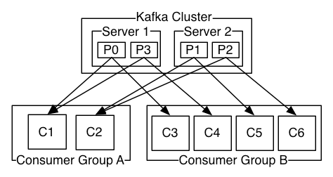

## 消费者和消费者组

+ 多个消费者构成一个消费者组，它们拥有相同的 `group_id`
+ 主题的分区只能被消费者组中的单个消费者订阅。

如上图所示，消费者组 A 中每个消费者订阅了两个分区。消费者组B中的每个消费者订阅了1个分区。

生产者向主题发送消息时只会向一个分区发，只有订阅了该分区的消费者才能收到消息。

以上图为例，假设消费者向 P0 发送了消息，只有 C1 和 C3 才能够收到消息。

这就意味着，消费者组中的消费者是轮询着消费消息的(在消息均匀分布在所有分区的前提下)。